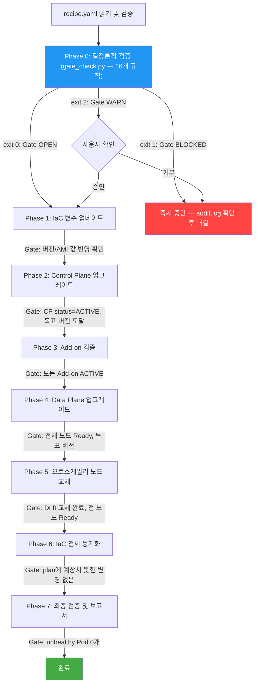

# K8s Upgrade Skills

Kubernetes 버전 업그레이드를 안전하게 완료할 수 있도록 도와주는 **AI Agent용 Skills**.

AI Agent가 `recipe.yaml`에 정의된 클러스터 정보를 읽고, 사전 검증 → 업그레이드 실행 → 사후 검증까지 phase-gated 방식으로 반자동 수행합니다. 각 단계에서 사용자 확인이 필요한 경우 즉시 중단하고 보고합니다.

---

> **Disclaimer**: 본 스킬은 Kubernetes 업그레이드 의사결정을 보조하는 AI Agent용 도구입니다. 사전 검증, 실행 계획 수립, 모니터링 등을 자동화하지만, 실제 인프라 변경에 대한 최종 책임은 실행자(사용자)에게 있습니다. 프로덕션 환경에서는 반드시 변경 내용을 검토한 후 진행하세요.

## 기능

- Kubernetes Control Plane / Data Plane 업그레이드 반자동 수행 (마이너 버전 +1)
  - "반자동" = Agent가 실행하되, CRITICAL/HIGH 검증 실패 시 즉시 중단하고 사용자 판단을 대기
- 16개 사전 검증 규칙으로 업그레이드 전 위험 요소 감지 후 사용자에게 보고
  - **결정론적 검증 (16개)**: `scripts/gate_check.py`가 독립 실행 — LLM이 bypass 불가
    - 클러스터 상태, 버전 호환성, kubelet skew, Add-on 호환성, PDB 차단, 단일 레플리카, PV AZ, 로컬 스토리지, 장시간 Job, 토폴로지 제약, 노드 용량, 리소스 압박 Pod, Surge 용량, Terraform drift, AMI 가용성, Karpenter 호환성, Recreate 감지
- 감사 로그(`audit.log`): 스크립트가 기록 주체, LLM은 읽기만 — 추적성 + Gate 신뢰성 확보
- Phase-gated 실행: 각 단계 Gate 미통과 시 즉시 중단 및 사용자 보고
- IaC 변경 사전 검토 후 적용 (예상치 못한 리소스 삭제 시 즉시 중단)
- `recipe.yaml` 기반 플랫폼/IaC 자동 라우팅 — 환경에 맞는 Sub-Skill 자동 선택
- recipe 스키마 검증 (`scripts/validate_recipe.py`) — 파싱 실패를 사전 차단

## 해당 스킬이 하지 않는 것

> 각 항목에 대한 상세 설명과 대안은 [QnA.md](QnA.md)를 참고하세요.
> 실패 시 대응 절차는 [docs/failure-runbook.md](docs/failure-runbook.md)를 참고하세요.

- CRITICAL 검증 실패 자동 해결 — 감지만 하고 해결은 사용자가 직접 수행 (PDB 수정, 노드 추가, PV 재배치 등)
- 자동 롤백 — EKS Control Plane 업그레이드는 비가역적. 실패 시 사용자에게 보고 후 판단 대기
- Zero-downtime 보장 — 위험 요소를 사전 감지하지만, 무중단을 검증하거나 보장하지 않음
- 마이너 버전 2단계 이상 건너뛰기 (예: 1.33 → 1.35 불가, 한 단계씩만)
- 워크로드 Spec 직접 수정 (PDB, replica 수, 노드 프로비저닝 등)
- Self-managed Node Group / Fargate 프로파일 업그레이드
- 현재 지원하지 않는 플랫폼/IaC 조합 (개발 현황 참조)

## 로드맵: 지능형 관측성 및 게이트 강화 (Priority 1)

현재의 Phase-gated 방식을 고도화하여, 인프라 상태(Ready)뿐만 아니라 실제 서비스 가용성(Endpoint)을 기준으로 업그레이드 진행 여부를 결정하는 것을 최우선 목표로 합니다.

### 1. 애플리케이션 가용성 기반 검증 (Service-Aware Gate)
- **현상:** 노드가 `Ready` 상태여도 Ingress/Service/HTTPRoute 등 네트워크 객체의 엔드포인트 전파 지연으로 인해 일시적인 서비스 단절(5xx 에러)이 발생할 수 있음.
- **개선:** recipe.md에 정의된 핵심 서비스(Service, Ingress, HTTPRoute)를 추적하여, 신규 노드 배치 후 엔드포인트(EndpointSlice) 가용 IP가 타겟 수치에 도달하고 실제 헬스체크 응답이 정상인 경우에만 다음 노드로 진행.

### 2. 병렬 Sub-Agent 기반 실시간 드레인(Drain) 모니터링
- **현상:** Terraform 실행 중 특정 Pod가 PDB 위반이나 Graceful Termination 실패로 드레인 프로세스에서 무한 대기하며 타임아웃을 유발함.
- **개선:** IaC 실행과 동시에 Sub-Agent를 병렬 투입하여 `kubectl get events -w` 과 같은 명령어로 드레인 프로세스를 실시간 감시.
  - 드레인 지연/실패 원인(예: PDB 교착 상태, 로컬 스토리지 점유 등)을 즉각 감지하여 사용자에게 보고 및 인터랙티브 대응 가이드 제시.

### 3. 고도화된 폴백(Fallback) 메커니즘
- **현상** 업그레이드 실패 시 원인 파악을 위해 수동으로 로그를 수집해야 하는 번거로움 존재.
- **개선** 검증 게이트 미통과 시 즉시 중단 및 **실패 시점의 클러스터 상태 스냅샷(Events, Pod Status, IaC Plan 결과)**을 자동 저장하여 AI Agent가 즉각적인 근원 분석(RCA) 리포트 제공.

## 개발 현황

| Environment | Platform | IaC | 상태 |
|-------------|----------|-----|------|
| AWS | EKS | Terraform | ✅ v1 — Self 검증 완료 |
| On-Premises | Kubespray | Ansible-playbook | 📋 계획됨 |

## Quick Start

전제조건: `python3` (3.9+), `kubectl`, `aws` CLI가 PATH에 있어야 합니다.

```bash
# 1. 스킬을 설치
git clone https://github.com/HaeDalWang/k8s-upgrade-skills.git
cd k8s-upgrade-skills
./install.sh

# 2. 쿠버네티스를 관리하는 프로젝트 디렉토리의 recipe.yaml 작성
# 3. AI Agent에게 요청: "클러스터를 업그레이드해줘"
```

> 테스트할 Kubernetes 클러스터가 없다면? [example/terraform-eks/](example/terraform-eks/)에 EKS + Karpenter 참조 인프라와 위험 시나리오 샘플이 포함되어 있습니다. Terraform으로 바로 배포하고 스킬을 테스트해볼 수 있습니다.

### install.sh

`install.sh`는 `k8s-upgrade-skills/` 디렉토리를 각 도구의 전역 스킬 경로에 복사합니다. 도구의 설정 파일(mcp.json 등)은 수정하지 않으며, 기존 설정에 영향을 주지 않습니다.

```bash
./install.sh                  # 인터랙티브 — 도구 선택
./install.sh --tool claude    # 특정 도구만 설치
./install.sh --all            # 모든 도구에 설치
./install.sh --status         # 설치 상태 확인
./install.sh --uninstall      # 전체 제거
```

### 지원 도구

| 도구 | 전역 설치 경로 |
|------|---------------|
| Claude Code | `~/.claude/skills/k8s-upgrade-skills/` |
| Kiro | `~/.kiro/skills/k8s-upgrade-skills/` |
| Cursor | `~/.cursor/skills/k8s-upgrade-skills/` |
| Windsurf | `~/.windsurf/skills/k8s-upgrade-skills/` |
| Gemini CLI | `~/.gemini/skills/k8s-upgrade-skills/` |
| OpenCode | `~/.agents/skills/k8s-upgrade-skills/` |
| Antigravity | `~/.agent/skills/k8s-upgrade-skills/` |
| GitHub Copilot | `~/.github/skills/k8s-upgrade-skills/` |

### recipe.yaml 작성 (권장)

Kubernetes를 관리하는 프로젝트 루트에 `recipe.yaml`을 만들고 클러스터 정보를 채웁니다:

```yaml
environment: aws          # aws | on-prem
platform: eks             # eks | kubespray
iac: terraform            # terraform | none
cluster_name: my-cluster  # 클러스터 식별자
current_version: "1.34"   # 현재 버전 (따옴표 필수)
target_version: "1.35"    # 목표 버전 (따옴표 필수) — 반드시 current_version의 차기 마이너 버전

# 선택 항목
output_language: ko       # ko | en
notes: ""                 # 특이사항
```

스키마 검증:
```bash
python3 scripts/validate_recipe.py recipe.yaml
```

> `recipe.md`(마크다운 내 YAML 블록)도 하위 호환으로 지원됩니다. **Deprecated**: v2에서 제거 예정이므로 새 프로젝트에서는 `recipe.yaml`을 사용하세요.
> target_version은 current_version 대비 마이너 버전 +1만 허용됩니다. (예: "1.34" → "1.35" ✅, "1.34" → "1.36" ❌)

흔한 실수와 에러 메시지:

| 실수 | 에러 메시지 | 해결 |
|------|------------|------|
| 버전에 따옴표 누락 (`1.34` → YAML이 float로 파싱) | `형식 오류 '1.3400...'` | `"1.34"` 따옴표 추가 |
| 버전 건너뛰기 (`1.33` → `1.36`) | `버전 건너뛰기 불가 (gap=3)` | 한 단계씩 실행 |
| 미지원 플랫폼 조합 | `미지원 조합: (on-prem, kubespray, none)` | 개발 현황 확인 |
| 필수 필드 누락 | `필수 필드 누락: 'cluster_name'` | 해당 필드 추가 |

### MCP 서버 (선택)
플랫폼 및 IaC 종류에 따라 MCP를 추가하면 더 정확한 검증이 가능합니다

| MCP 서버 | 용도 |
|----------|------|
| `awslabs.eks-mcp-server` | EKS Insights, K8s 리소스 조회 |
| `kubernetes-mcp-server` | kubectl 기반 노드/Pod 상태 조회 |

MCP 서버가 없어도 Agent는 AWS CLI / kubectl 등 일반적인 Command로 fallback합니다.

### 필요 권한 (IAM / RBAC)

이 스킬이 실행하는 명령어에 필요한 최소 권한은 [docs/required-permissions.md](docs/required-permissions.md)를 참조하세요.

| 단계 | IAM | RBAC | 설명 |
|------|-----|------|------|
| Phase 0 (사전 검증) | EKS/SSM/EC2 읽기 전용 | `k8s-upgrade-preflight` | 안전, 읽기만 |
| Phase 1~7 (실행) | + EKS 업데이트 + Terraform State | `k8s-upgrade-execution` | 쓰기 포함 |

## 업그레이드 워크플로우



## 사전 검증 규칙 (16개)

| 검증 주체 | 카테고리 | 규칙 수 | 핵심 검증 내용 |
|-----------|----------|---------|---------------|
| 🔧 스크립트 | common | 4개 | 클러스터 상태, 버전 호환성, kubelet skew, Add-on 호환성 |
| 🔧 스크립트 | workload-safety | 6개 | PDB 차단, 단일 레플리카, PV AZ 고정, 로컬 스토리지, 장시간 Job, 토폴로지 제약 |
| 🔧 스크립트 | capacity | 3개 | 노드 용량 여유분, 리소스 압박 Pod, Surge 용량 |
| 🔧 스크립트 | infrastructure | 4개 | Terraform drift, AMI 가용성, Karpenter 호환성, Recreate 감지 |

🔧 = `scripts/gate_check.py`가 결정론적으로 판단 (exit code 기반, LLM bypass 불가)

심각도: `CRITICAL`(즉시 중단) > `HIGH`(사용자 확인) > `MEDIUM`(보고만) > `LOW`(참고)

## 프로젝트 구조

```
├── k8s-upgrade-skills/                 # AI Agent 스킬 정의 (핵심)
│   ├── SKILL.md                        #   루트 라우터 — recipe 검증 + Sub-Skill 분기
│   └── aws/terraform-eks/              #   EKS + Terraform 업그레이드 스킬
│       ├── SKILL.md                    #     Phase 0~7 실행 절차
│       ├── reference.md               #     보고서 템플릿, 중단 조건
│       └── rules/                     #     사전 검증 규칙 시스템 (16개)
│           ├── rule-index.md          #       규칙 색인 + 실행 순서
│           ├── common/                #       공통 규칙 (3개)
│           ├── workload-safety/       #       워크로드 안전성 규칙 (6개)
│           ├── capacity/              #       용량 검증 규칙 (3개)
│           └── infrastructure/        #       인프라 검증 규칙 (4개)
├── scripts/                            # 결정론적 검증 스크립트 (P0 Gate)
│   ├── gate_check.py                  #   Phase 0-A 독립 검증 (exit code로 Gate 제어)
│   └── validate_recipe.py             #   recipe.yaml 스키마 검증
├── docs/                               # 운영 문서
│   ├── required-permissions.md        #   IAM/RBAC 최소 권한 가이드
│   └── failure-runbook.md             #   실패 시나리오별 대응 절차
├── example/terraform-eks/              # EKS + Karpenter 참조 Terraform 코드
│   ├── recipe.yaml                    #   업그레이드 요구사항 예제 (권장 형식)
│   ├── recipe.md                      #   업그레이드 요구사항 예제 (하위 호환)
│   └── terraform/                     #   eks.tf, network.tf, yamls/ 등
├── install.sh                          # 전역 설치 스크립트
└── README.md
```
