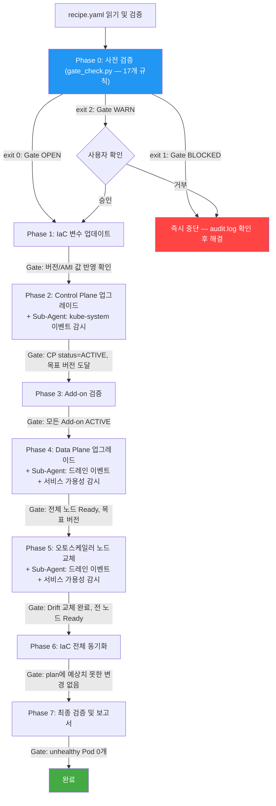

# K8s Upgrade Skills

Kubernetes 버전 업그레이드를 안전하게 완료할 수 있도록 도와주는 **AI Agent용 Skills**.

AI Agent가 `recipe.yaml`에 정의된 클러스터 정보를 읽고, 사전 검증 → 업그레이드 실행 → 사후 검증까지 phase-gated 방식으로 반자동 수행합니다. 각 단계에서 사용자 확인이 필요한 경우 즉시 중단하고 보고합니다.

---

> **Disclaimer**: 본 스킬은 Kubernetes 업그레이드 의사결정을 보조하는 AI Agent용 도구입니다. 사전 검증, 실행 계획 수립, 모니터링 등을 자동화하지만, 실제 인프라 변경에 대한 최종 책임은 실행자(사용자)에게 있습니다. 프로덕션 환경에서는 반드시 변경 내용을 검토한 후 진행하세요.

> **⚠️ 프로덕션 사용 주의**: Phase 0 사전 검증(17개 규칙)은 `scripts/gate_check.py`가, Phase 2~7 Gate는 `scripts/phase_gate.py`가 스크립트로 판단합니다. Phase 1 Gate(IaC 변수 업데이트 확인)만 LLM이 해석합니다. 프로덕션에서는 각 Phase 완료 후 수동 교차 검증을 권장합니다.

## 기능

- Kubernetes Control Plane / Data Plane 업그레이드 반자동 수행 (마이너 버전 +1)
  - "반자동" = Agent가 실행하되, CRITICAL/HIGH 검증 실패 시 즉시 중단하고 사용자 판단을 대기
- 17개 사전 검증 규칙으로 업그레이드 전 위험 요소 감지 후 사용자에게 보고
  - **스크립트 검증 (17개)**: `scripts/gate_check.py`가 독립 실행 — LLM이 bypass 불가
    - 클러스터 상태, 버전 호환성(+kubelet skew), Add-on 호환성, PDB 차단, 단일 레플리카, PV AZ, 로컬 스토리지, 장시간 Job, 토폴로지 제약, 노드 용량, 리소스 압박 Pod, Surge 용량, Terraform drift, AMI 가용성, Karpenter 호환성, Recreate 감지
- 감사 로그(`audit.log`): 스크립트가 기록 주체, LLM은 읽기만 — 추적성 + Gate 신뢰성 확보
- Phase-gated 실행: 각 단계 Gate 미통과 시 즉시 중단 및 사용자 보고
- IaC 변경 사전 검토 후 적용 (예상치 못한 리소스 삭제 시 즉시 중단)
- `recipe.yaml` 기반 플랫폼/IaC 자동 라우팅 — 환경에 맞는 Sub-Skill 자동 선택
- recipe 스키마 검증 (`scripts/validate_recipe.py`) — 파싱 실패를 사전 차단
- **병렬 Sub-Agent 드레인 모니터** (로드맵 2 ✅): terraform apply 실행과 동시에 Sub-Agent가 `kubectl get events`로 드레인 이벤트 실시간 감시. 감지 이벤트는 `audit_event.py`를 통해 audit.log에 기록
- **Service-Aware Sub-Agent** (로드맵 1 ✅): 노드 교체 중 EndpointSlice ready 수 + HTTP 헬스체크로 서비스 가용성 실시간 감시 (BestEffort)

## 해당 스킬이 하지 않는 것

> 각 항목에 대한 상세 설명과 대안은 [QnA.md](QnA.md)를 참고하세요.
> 실패 시 대응 절차는 [docs/failure-runbook.md](docs/failure-runbook.md)를 참고하세요.

- CRITICAL 검증 실패 자동 해결 — 감지만 하고 해결은 사용자가 직접 수행 (PDB 수정, 노드 추가, PV 재배치 등)
- 자동 롤백 — EKS Control Plane 업그레이드는 비가역적. 실패 시 사용자에게 보고 후 판단 대기
- Zero-downtime 보장 — 위험 요소를 사전 감지하지만, 무중단을 검증하거나 보장하지 않음
- 마이너 버전 2단계 이상 건너뛰기 (예: 1.33 → 1.35 불가, 한 단계씩만)
- 워크로드 Spec 직접 수정 (PDB, replica 수, 노드 프로비저닝 등)
- Self-managed Node Group / Fargate 프로파일 업그레이드
- 현재 지원하지 않는 플랫폼/IaC 조합 (개발 현황 참조)

## 로드맵

| # | 기능 | 상태 |
|---|------|------|
| 1 | **Service-Aware Sub-Agent** — 노드 교체 중 EndpointSlice + HTTP 헬스체크로 서비스 가용성 실시간 감시 | ✅ 완료 |
| 2 | **병렬 Sub-Agent 드레인 모니터** — terraform apply와 동시에 드레인 이벤트 실시간 감시 및 audit.log 기록 | ✅ 완료 |
| 3 | **고도화된 폴백 메커니즘** — 실패 시점 클러스터 상태 스냅샷 자동 저장 + AI RCA 리포트 | 📋 계획됨 |

## 개발 현황

| Environment | Platform | IaC | 상태 |
|-------------|----------|-----|------|
| AWS | EKS | Terraform | ✅ v1 — Self 검증 완료 |
| On-Premises | Kubespray | Ansible-playbook | 📋 계획됨 |

## Quick Start

전제조건: `python3` (3.9+), `kubectl`, `aws` CLI가 PATH에 있어야 합니다.

```bash
# 1. 스킬을 설치
git clone https://github.com/HaeDalWang/k8s-upgrade-skills.git
cd k8s-upgrade-skills
./install.sh
# 2. 쿠버네티스를 관리하는 프로젝트 디렉토리에서 AI Agent에게 요청
# "EKS 클러스터를 업그레이드해줘"
# → recipe.yaml이 없으면 Agent가 필요한 정보를 물어보고 자동 생성
```

> 테스트할 Kubernetes 클러스터가 없다면? [example/terraform-eks/](example/terraform-eks/)에 EKS + Karpenter 참조 인프라와 위험 시나리오 샘플이 포함되어 있습니다. Terraform으로 바로 배포하고 스킬을 테스트해볼 수 있습니다.

### install.sh

`install.sh`는 `k8s-upgrade-skills/` 디렉토리를 각 도구의 전역 스킬 경로에 복사합니다. 도구의 설정 파일(mcp.json 등)은 수정하지 않으며, 기존 설정에 영향을 주지 않습니다.

```bash
./install.sh                  # 인터랙티브 — 도구 선택
./install.sh --tool claude    # 특정 도구만 설치
./install.sh --all            # 모든 도구에 설치
./install.sh --force          # 재설치(업데이트)
./install.sh --status         # 설치 상태 확인
./install.sh --uninstall      # 전체 제거
```

### 지원 도구

| 도구 | 전역 설치 경로 |
|------|---------------|
| Claude Code | `~/.claude/skills/k8s-upgrade-skills/` |
| Kiro | `~/.kiro/skills/k8s-upgrade-skills/` |
| Cursor | `~/.cursor/skills/k8s-upgrade-skills/` |
| Windsurf | `~/.windsurf/skills/k8s-upgrade-skills/` |
| Gemini CLI | `~/.gemini/skills/k8s-upgrade-skills/` |
| OpenCode | `~/.agents/skills/k8s-upgrade-skills/` |
| Antigravity | `~/.agent/skills/k8s-upgrade-skills/` |
| GitHub Copilot | `~/.github/skills/k8s-upgrade-skills/` |

### recipe.yaml 작성

`recipe.yaml`이 없으면 Agent가 필요한 정보를 한 번에 물어보고 자동 생성합니다. 이미 있으면 그대로 재사용합니다.

직접 작성하려면 프로젝트 루트에 아래 형식으로 만드세요:

```yaml
environment: aws          # aws | on-prem
platform: eks             # eks | kubespray
iac: terraform            # terraform | none
cluster_name: my-cluster  # 클러스터 식별자
current_version: "1.34"   # 현재 버전 (따옴표 필수)
target_version: "1.35"    # 목표 버전 (따옴표 필수) — 반드시 current_version의 차기 마이너 버전

# 선택 항목
output_language: ko       # ko | en
notes: ""                 # 특이사항

# 서비스 가용성 모니터링 (선택) — 없으면 Service-Aware Sub-Agent SKIP
services:
  - name: my-api
    namespace: production
    min_endpoints: 2
    health_check_url: "https://api.example.com/health"  # 외부 접근 가능 URL
  - name: my-worker
    namespace: production
    min_endpoints: 1
    # health_check_url 없음 → BestEffort 모드 (EndpointSlice만 확인)
```

> **Service-Aware Gate 한계 안내**
>
> `services` 필드는 노드 교체 중 서비스 가용성을 실시간으로 감시하는 Sub-Agent를 투입합니다.
>
> | 설정 | 감시 방식 | 보장 수준 |
> |------|---------|---------|
> | `health_check_url` 있음 | EndpointSlice ready 수 + HTTP 응답 확인 | 트래픽 레벨 감시 |
> | `health_check_url` 없음 | EndpointSlice ready 수만 확인 | **BestEffort** — Pod 레벨만 |
>
> - `health_check_url`은 에이전트 실행 환경에서 **외부 접근 가능한 URL**이어야 합니다 (VPC 내부 URL 불가)
> - `health_check_url` 없이는 ALB/Ingress 전파 지연으로 인한 일시적 5xx를 감지할 수 없습니다
> - 진정한 무중단을 원한다면 `health_check_url` 설정을 강력히 권장합니다

### 필요 권한 (IAM / RBAC)

이 스킬이 실행하는 명령어에 필요한 최소 권한은 [docs/required-permissions.md](docs/required-permissions.md)를 참조하세요.

| 단계 | IAM | RBAC | 설명 |
|------|-----|------|------|
| Phase 0 (사전 검증) | EKS/SSM/EC2 읽기 전용 | `k8s-upgrade-preflight` | 안전, 읽기만 |
| Phase 1~7 (실행) | + EKS 업데이트 + Terraform State | `k8s-upgrade-execution` | 쓰기 포함 |

### Claude Code 권한 설정 (settings.local.json)

이 스킬은 아래 명령어를 자동 실행합니다. `.claude/settings.local.json`에 미리 허용해두면 매번 승인 없이 진행됩니다.

```json
{
  "permissions": {
    "allow": [
      "Bash(python3 k8s-upgrade-skills/scripts/validate_recipe.py:*)",
      "Bash(python3 k8s-upgrade-skills/scripts/gate_check.py:*)",
      "Bash(python3 k8s-upgrade-skills/scripts/phase_gate.py:*)",
      "Bash(python3 k8s-upgrade-skills/scripts/audit_event.py:*)",
      "Bash(kubectl get:*)",
      "Bash(kubectl describe:*)",
      "Bash(kubectl patch:*)",
      "Bash(kubectl scale:*)",
      "Bash(kubectl delete:*)",
      "Bash(aws eks:*)",
      "Bash(aws ssm:*)",
      "Bash(terraform plan:*)",
      "Bash(terraform apply:*)"
    ]
  }
}
```

> `kubectl patch/scale/delete`는 Phase 0 CRITICAL 해소 조치(PDB 수정, padding Pod 삭제 등)에 사용됩니다. 읽기 전용 사전 검증만 원한다면 해당 항목을 제외하세요.

## 업그레이드 워크플로우



## 사전 검증 규칙 (17개)

| 검증 주체 | 카테고리 | 규칙 수 | 핵심 검증 내용 |
|-----------|----------|---------|---------------|
| 스크립트 | common | 4개 | 클러스터 상태, 버전 호환성, kubelet skew, Add-on 호환성 |
| 스크립트 | workload-safety | 6개 | PDB 차단, 단일 레플리카, PV AZ 고정, 로컬 스토리지, 장시간 Job, 토폴로지 제약 |
| 스크립트 | capacity | 3개 | 노드 용량 여유분, 리소스 압박 Pod, Surge 용량 |
| 스크립트 | infrastructure | 4개 | Terraform drift, AMI 가용성, Karpenter 호환성, Recreate 감지 |

스크립트 = `scripts/gate_check.py`가 exit code 기반으로 판단 (LLM bypass 불가)

심각도: `CRITICAL`(즉시 중단) > `HIGH`(사용자 확인) > `MEDIUM`(보고만) > `LOW`(참고)

## 프로젝트 구조

```
├── k8s-upgrade-skills/                 # AI Agent 스킬 정의 (핵심)
│   ├── SKILL.md                        #   루트 라우터 — recipe 검증 + Sub-Skill 분기
│   ├── scripts/
│   │   ├── lib.py                      #     공통 헬퍼 (_gate 단일 진실 원천, audit 함수)
│   │   ├── gate_check.py               #     Phase 0 독립 검증 (exit code로 Gate 제어)
│   │   ├── phase_gate.py               #     Phase 2~7 Gate 검증 (exit code로 Gate 제어)
│   │   ├── validate_recipe.py          #     recipe.yaml 스키마 검증 (services 필드 포함)
│   │   └── audit_event.py              #     Sub-Agent용 단일 이벤트 audit.log 기록 CLI
│   ├── schemas/
│   │   └── recipe.schema.json          #     recipe.yaml IDE 스키마 (VSCode/Kiro)
│   └── aws/terraform-eks/
│       ├── SKILL.md                    #     Phase 0~7 실행 절차 + Sub-Agent 투입 지시
│       └── reference.md               #     보고서 템플릿, 중단 조건
├── docs/
│   ├── required-permissions.md        #   IAM/RBAC 최소 권한 가이드
│   └── failure-runbook.md             #   실패 시나리오별 대응 절차 (Sub-Agent 보고 해석 포함)
├── example/terraform-eks/              # EKS + Karpenter 참조 Terraform 코드
│   ├── recipe.yaml                    #   업그레이드 요구사항 예제 (services 필드 포함)
│   └── terraform/                     #   eks.tf, network.tf, yamls/ 등
├── tests/
│   ├── test_gate_check.py             #   gate_check.py 단위 테스트
│   ├── test_phase_gate.py             #   phase_gate.py 단위 테스트
│   ├── test_audit_event.py            #   audit_event.py 단위 테스트
│   └── test_validate_recipe.py        #   validate_recipe.py 단위 테스트 (services 포함)
├─ install.sh                          # 전역 설치 스크립트
└── README.md
```
