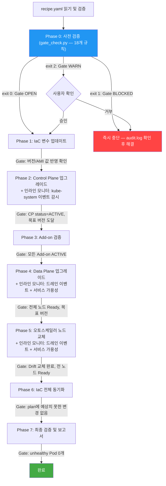

# K8s Upgrade Skills

Kubernetes 버전 업그레이드를 안전하게 완료할 수 있도록 도와주는 **AI Agent용 Skills**.

AI Agent가 `recipe.md`에 정의된 클러스터 정보를 읽고, 사전 검증 → 업그레이드 실행 → 사후 검증까지 phase-gated 방식으로 반자동 수행합니다. 각 단계에서 사용자 확인이 필요한 경우 즉시 중단하고 보고합니다.

## 왜 만들었나

EKS 업그레이드처럼 **고위험·다단계·장기 체공** 작업은 운영 부담이 큽니다. 이 프로젝트는 개인의 인프라 트러블슈팅 노하우를 AI Agent의 'Skill'로 명세화해, 작업 안정성을 높이면서 엔지니어의 리소스를 더 가치 있는 업무로 돌릴 수 있다는 가설에서 출발했습니다.

여기까지 오는 데 세 단계를 거쳤습니다:

1. **단순 질의응답** — 일반 AI 챗봇에 트러블슈팅을 물었지만, 급변하는 오픈소스 생태계의 정확한 버전·의존성 추적에 한계가 있었습니다.
2. **컨텍스트 결합** — Cursor·Kiro·Claude Code·Antigravity 등의 에이전트에 시스템 프롬프트와 MCP를 통합하고, AWS 공식 문서 기반 팩트체크와 본인의 트러블슈팅 스타일을 동기화했습니다. 해결 능력은 좋아졌지만, 사전 작업·실시간 에러 대응·사후 검증이 한 흐름으로 묶인 작업은 결국 작업자가 전체 루틴을 직접 통제해야 하는 한계가 남았습니다.
3. **Skill로 구조화** — 수동 프로세스 자체를 에이전트가 인지하고 실행하는 'Skills'로 구조화했습니다. 그 결과:
   - **영향도 분석 정밀화** — 5,000라인이 넘는 Helm Values 같은 대규모 파일을 사람의 수동 탐색(Ctrl+F) 대신 AI 파싱으로 분석해 누락과 휴먼 에러를 제거합니다.
   - **가시성·추적성 확보** — 작업 수행 과정을 `audit.log`와 Markdown 보고서로 추출해, 작업 계획서·결과 보고서 작성 시간을 크게 줄입니다.

결국 목표는 **작업 난이도의 하향 평준화**입니다. 고객 프로덕션 환경에서의 단 한 번의 휴먼 에러가 일으키는 치명적 장애를 시스템 레벨에서 차단하고, 주기적으로 반복되는 업그레이드의 심리적 압박을 덜며, 그렇게 절약한 시간과 집중력을 새로운 기술 학습과 핵심 업무에 재투자하는 환경을 만드는 것입니다.

---

> **Disclaimer**: 본 스킬은 Kubernetes 업그레이드 의사결정을 보조하는 AI Agent용 도구입니다. 사전 검증, 실행 계획 수립, 모니터링 등을 자동화하지만, 실제 인프라 변경에 대한 최종 책임은 실행자(사용자)에게 있습니다. 프로덕션 환경에서는 반드시 변경 내용을 검토한 후 진행하세요.

> **⚠️ 프로덕션 사용 주의**: Phase 0 사전 검증(18개 규칙)은 `scripts/gate_check.py`가, Phase 2~7 Gate는 `scripts/phase_gate.py`가 스크립트로 판단합니다. Phase 1 Gate(IaC 변수 업데이트 확인)만 LLM이 해석합니다. 프로덕션에서는 각 Phase 완료 후 수동 교차 검증을 권장합니다.

## 기능

- Kubernetes Control Plane / Data Plane 업그레이드 반자동 수행 (마이너 버전 +1)
  - "반자동" = Agent가 실행하되, CRITICAL/HIGH 검증 실패 시 즉시 중단하고 사용자 판단을 대기
- 18개 사전 검증 규칙으로 업그레이드 전 위험 요소 감지 후 사용자에게 보고
  - **스크립트 검증 (18개)**: `scripts/gate_check.py`가 독립 실행 — LLM이 bypass 불가
    - 클러스터 상태, 버전 호환성(+kubelet skew), Add-on 호환성, EKS Insights 업그레이드 준비도(제거/Deprecated API), PDB 차단, 단일 레플리카, PV AZ, 로컬 스토리지, 장시간 Job, 토폴로지 제약, 노드 용량, 리소스 압박 Pod, Surge 용량, Terraform drift, AMI 가용성, Karpenter 호환성, Recreate 감지
- 감사 로그(`audit.log`): 스크립트가 기록 주체, LLM은 읽기만 — 추적성 + Gate 신뢰성 확보
- Phase-gated 실행: 각 단계 Gate 미통과 시 즉시 중단 및 사용자 보고
- IaC 변경 사전 검토 후 적용 (예상치 못한 리소스 삭제 시 즉시 중단)
- `recipe.md` 기반 플랫폼/IaC 자동 라우팅 — 환경에 맞는 Sub-Skill 자동 선택
- recipe 스키마 검증 (`scripts/validate_recipe.py`) — 파싱 실패를 사전 차단
- **인라인 드레인 모니터** (`scripts/drain_watch.py`): terraform apply와 동시에 메인 에이전트가 백그라운드로 실행. Warning 이벤트 / PDB 차단 / NodeClaim 상태를 30초 주기로 폴링해 드레인 위험을 `DRAIN-P*`로 audit.log에 기록
- **인라인 서비스 모니터** (`scripts/service_watch.py`): 노드 교체 중 EndpointSlice ready 수 + HTTP 헬스체크로 서비스 가용성 감시 (BestEffort). `recipe`에 `services`가 있을 때만 투입
  - > 별도 Sub-Agent가 아닌 **메인 에이전트의 백그라운드 폴링**으로 동작합니다. Claude Code 에이전트는 동기 호출-반환 모델이라 "감시 중 즉시 STOP 신호"를 보낼 수 없어, 결정적 폴링 스크립트로 구현했습니다. (근거: `agents/k8s-drain-monitor.md`)

## 해당 스킬이 하지 않는 것

> 각 항목에 대한 상세 설명과 대안은 [QnA.md](QnA.md)를 참고하세요.
> 실패 시 대응 절차는 [docs/failure-runbook.md](docs/failure-runbook.md)를 참고하세요.

- CRITICAL 검증 실패 자동 해결 — 감지만 하고 해결은 사용자가 직접 수행 (PDB 수정, 노드 추가, PV 재배치 등)
- 자동 롤백 — EKS Control Plane 업그레이드는 비가역적. 실패 시 사용자에게 보고 후 판단 대기
- Zero-downtime 보장 — 위험 요소를 사전 감지하지만, 무중단을 검증하거나 보장하지 않음
- 마이너 버전 2단계 이상 건너뛰기 (예: 1.33 → 1.35 불가, 한 단계씩만)
- 워크로드 Spec 직접 수정 (PDB, replica 수, 노드 프로비저닝 등)
- Self-managed Node Group 업그레이드 (Managed Node Group · Karpenter는 지원)
  - Fargate 프로파일 정의(IaC) 변경은 하지 않지만, CP 업그레이드 후 Fargate 노드 kubelet 갱신을 위한 Pod `rollout restart`는 Phase 7-0에서 수행합니다
- 현재 지원하지 않는 플랫폼/IaC 조합 (개발 현황 참조)

## 함께 설치되는 스킬: helm-k8s-compat

`install.sh`는 두 개의 독립 스킬을 함께 설치합니다.

| 스킬 | 역할 | 트리거 |
|------|------|--------|
| `k8s-upgrade-skills` | K8s/EKS 버전 업그레이드 (Phase-gated) | "EKS 클러스터를 업그레이드해줘" |
| `helm-k8s-compat` | Helm 차트 ↔ K8s 버전 호환성 **사전 점검** | "Helm 차트 호환성 점검해줘" |

`helm-k8s-compat`은 EKS Insights·kubent가 못 잡는 **차트 레벨 호환성 함정**을 업그레이드 전에 검출합니다. 두 도구는 라이브 API 서버에 호출된 API만 스캔하지만, 실제 업그레이드를 깨먹는 건 대부분 "이 차트 버전이 대상 K8s를 지원하는가, 컨트롤러가 계속 작동하는가" — 릴리스 노트와 지원 매트릭스에만 있는 지식입니다.

De-facto 표준 차트(ingress-nginx, cert-manager, cluster-autoscaler, aws-load-balancer-controller, kube-prometheus-stack)를 큐레이션한 registry와 라이브 `helm` 조회를 결합해 다음을 검출합니다:

- **지원 버전 윈도우 초과** — 예: ingress-nginx 4.13.x는 K8s 1.33이 상한 → 1.34 업그레이드 전 차트를 먼저 올려야 함
- **retirement / EOL** — 차트 전체 retirement(ingress-nginx 2026-03) 또는 release별 날짜 EOL(cert-manager)
- **K8s API 제거 충돌** — 버전 점프 구간에 걸린 제거 API (PSP, v1beta1 Ingress 등)
- **수동 업그레이드 함정** — Helm이 자동 처리하지 않는 CRD 재적용 / IAM 정책 / webhook 전환

판정은 `helm_compat_check.py`의 exit code(0/1/2/127)로 결정되며, 기존 스킬과 동일한 신뢰 모델을 따릅니다. 자세한 내용은 [QnA.md](QnA.md)의 "Helm 차트 호환성" 항목을 참고하세요.

> **한계**: registry는 표준 차트를 깊게 큐레이션한 것으로 모든 차트를 망라하지 않습니다. 미등록 차트는 `kubeVersion` best-effort + "수동 검토 필요"로 보고하며 조용히 통과시키지 않습니다. EKS Insights·kubent(API 스캔)와는 **상호 보완** 관계입니다.

## 로드맵

| # | 기능 | 상태 |
|---|------|------|
| 1 | **고도화된 폴백 메커니즘** — 실패 시점 클러스터 상태 스냅샷 자동 저장 + AI RCA 리포트 | 📋 계획됨 |

## 개발 현황

| Environment | Platform | IaC | 상태 |
|-------------|----------|-----|------|
| AWS | EKS | Terraform | v1 — Self 검증 중|
| On-Premises | Kubespray | Ansible-playbook | 📋 계획됨 |

## Quick Start

전제조건: `python3` (3.9+), `kubectl`, `aws` CLI가 PATH에 있어야 합니다.

```bash
# 1. 스킬을 설치
git clone https://github.com/HaeDalWang/k8s-upgrade-skills.git
cd k8s-upgrade-skills
./install.sh
# 2. 쿠버네티스를 관리하는 프로젝트 디렉토리에서 AI Agent에게 요청
# "EKS 클러스터를 업그레이드해줘"
# → recipe.md가 없으면 Agent가 필요한 정보를 물어보고 자동 생성
```

> 테스트할 Kubernetes 클러스터가 없다면? [example/terraform-eks/](example/terraform-eks/)에 EKS + Karpenter 참조 인프라와 위험 시나리오 샘플이 포함되어 있습니다. Terraform으로 바로 배포하고 스킬을 테스트해볼 수 있습니다.

### install.sh

`install.sh`는 두 개의 최상위 스킬(`k8s-upgrade-skills/`, `helm-k8s-compat/`)을 각 도구의 전역 스킬 경로에 복사합니다. 도구의 설정 파일(mcp.json 등)은 수정하지 않으며, 기존 설정에 영향을 주지 않습니다.

```bash
./install.sh                  # 인터랙티브 — 도구 선택
./install.sh --tool claude    # 특정 도구만 설치
./install.sh --all            # 모든 도구에 설치
./install.sh --force          # 재설치(업데이트)
./install.sh --status         # 설치 상태 확인
./install.sh --uninstall      # 전체 제거
```

### 지원 도구

| 도구 | 전역 설치 경로 |
|------|---------------|
| Claude Code | `~/.claude/skills/k8s-upgrade-skills/` |
| Kiro | `~/.kiro/skills/k8s-upgrade-skills/` |
| Cursor | `~/.cursor/skills/k8s-upgrade-skills/` |
| Windsurf | `~/.windsurf/skills/k8s-upgrade-skills/` |
| Gemini CLI | `~/.gemini/skills/k8s-upgrade-skills/` |
| OpenCode | `~/.agents/skills/k8s-upgrade-skills/` |
| Antigravity | `~/.agent/skills/k8s-upgrade-skills/` |
| GitHub Copilot | `~/.github/skills/k8s-upgrade-skills/` |

### recipe.md 작성

`recipe.md`가 없으면 Agent가 필요한 정보를 한 번에 물어보고 자동 생성합니다. 이미 있으면 그대로 재사용합니다.

직접 작성하려면 프로젝트 루트에 아래 형식(YAML frontmatter)으로 만드세요:

```markdown
---
environment: aws          # aws | on-prem
platform: eks             # eks | kubespray
iac: terraform            # terraform | none
cluster_name: my-cluster  # 클러스터 식별자
current_version: "1.34"   # 현재 버전 (따옴표 필수)
target_version: "1.35"    # 목표 버전 (따옴표 필수) — 반드시 current_version의 차기 마이너 버전

# 선택 항목
output_language: ko       # ko | en
auth_prefix: ""           # terraform/aws 명령 프리픽스 (예: "aws-runas ezl-switch"). MFA assume-role 등
tf_var_file: ""           # terraform var-file (예: "ezl-dev.tfvars"). workspace별 tfvars 사용 시

# 서비스 가용성 모니터링 (선택) — 없으면 인라인 service_watch SKIP
services:
  - name: my-api
    namespace: production
    min_endpoints: 2
    health_check_url: "https://api.example.com/health"  # 외부 접근 가능 URL
  - name: my-worker
    namespace: production
    min_endpoints: 1
    # health_check_url 없음 → BestEffort 모드 (EndpointSlice만 확인)
---

## 업그레이드 컨텍스트

(현재 상황, 제약사항, 특이사항을 자유롭게 서술)
```

> **Service-Aware Gate 한계 안내**
>
> `services` 필드는 노드 교체 중 서비스 가용성을 감시하는 인라인 모니터(`service_watch.py`)를 투입합니다.
>
> | 설정 | 감시 방식 | 보장 수준 |
> |------|---------|---------|
> | `health_check_url` 있음 | EndpointSlice ready 수 + HTTP 응답 확인 | 트래픽 레벨 감시 |
> | `health_check_url` 없음 | EndpointSlice ready 수만 확인 | **BestEffort** — Pod 레벨만 |
>
> - `health_check_url`은 에이전트 실행 환경에서 **외부 접근 가능한 URL**이어야 합니다 (VPC 내부 URL 불가)
> - `health_check_url` 없이는 ALB/Ingress 전파 지연으로 인한 일시적 5xx를 감지할 수 없습니다
> - 진정한 무중단을 원한다면 `health_check_url` 설정을 강력히 권장합니다

> **`recipe.yaml` 호환**: 기존 `recipe.yaml` 파일도 여전히 지원됩니다. 다만 frontmatter 방식의 `recipe.md`가 자유 형식 컨텍스트를 함께 기술할 수 있어 권장됩니다.

### 필요 권한 (IAM / RBAC)

이 스킬이 실행하는 명령어에 필요한 최소 권한은 [docs/required-permissions.md](docs/required-permissions.md)를 참조하세요.

| 단계 | IAM | RBAC | 설명 |
|------|-----|------|------|
| Phase 0 (사전 검증) | EKS/SSM/EC2 읽기 전용 | `k8s-upgrade-preflight` | 안전, 읽기만 |
| Phase 1~7 (실행) | + EKS 업데이트 + Terraform State | `k8s-upgrade-execution` | 쓰기 포함 |

### Claude Code 권한 설정 (settings.local.json)

이 스킬은 아래 명령어를 자동 실행합니다. `.claude/settings.local.json`에 미리 허용해두면 매번 승인 없이 진행됩니다.

```json
{
  "permissions": {
    "allow": [
      "Bash(python3 k8s-upgrade-skills/scripts/*)",
      "Bash(python3 scripts/*)",
      "Bash(kubectl get *)",
      "Bash(kubectl describe *)",
      "Bash(kubectl patch *)",
      "Bash(kubectl scale *)",
      "Bash(kubectl delete pod*)",
      "Bash(aws eks *)",
      "Bash(aws ssm *)",
      "Bash(terraform plan*)",
      "Bash(terraform apply*)",
      "Bash(terraform show*)",
      "Bash(find . *)",
      "Bash(grep *)",
      "Bash(jq *)",
      "Bash(curl -sf*)"
    ]
  }
}
```

> `kubectl patch/scale/delete`는 Phase 0 CRITICAL 해소 조치(PDB 수정, padding Pod 삭제 등)에 사용됩니다. 읽기 전용 사전 검증만 원한다면 해당 항목을 제외하세요.
> `jq`, `curl`은 Phase 2 타임아웃 감지(MNG 상태 확인) 및 인라인 서비스 모니터(`service_watch.py` 헬스체크)에 사용됩니다.

## 업그레이드 워크플로우


```mermaid
graph TD
    A[recipe.yaml 읽기 및 검증] --> B0["Phase 0: 사전 검증 (gate_check.py — 18개 규칙)"]
    B0 -- "exit 0: Gate OPEN" --> C[Phase 1: IaC 변수 업데이트]
    B0 -- "exit 1: Gate BLOCKED" --> STOP[즉시 중단 — audit.log 확인 후 해결]
    B0 -- "exit 2: Gate WARN" --> USER_CONFIRM{사용자 확인}
    USER_CONFIRM -- "승인" --> C
    USER_CONFIRM -- "거부" --> STOP
    C -- "Gate: 버전/AMI 값 반영 확인" --> D["Phase 2: Control Plane 업그레이드\n+ 인라인 모니터: kube-system 이벤트 감시"]
    D -- "Gate: CP status=ACTIVE, 목표 버전 도달" --> E[Phase 3: Add-on 검증]
    E -- "Gate: 모든 Add-on ACTIVE" --> F["Phase 4: Data Plane 업그레이드\n+ 인라인 모니터: 드레인 이벤트 + 서비스 가용성"]
    F -- "Gate: 전체 노드 Ready, 목표 버전" --> G["Phase 5: 오토스케일러 노드 교체\n+ 인라인 모니터: 드레인 이벤트 + 서비스 가용성"]
    G -- "Gate: Drift 교체 완료, 전 노드 Ready" --> H[Phase 6: IaC 전체 동기화]
    H -- "Gate: plan에 예상치 못한 변경 없음" --> I[Phase 7: 최종 검증 및 보고서]
    I -- "Gate: unhealthy Pod 0개" --> J[완료]

    style STOP fill:#f44,color:#fff
    style J fill:#4a4,color:#fff
    style B0 fill:#2196F3,color:#fff
```

## 사전 검증 규칙 (18개)

| 검증 주체 | 카테고리 | 규칙 수 | 핵심 검증 내용 |
|-----------|----------|---------|---------------|
| 스크립트 | common | 5개 | 클러스터 상태, 버전 호환성, kubelet skew, Add-on 호환성, EKS Insights 업그레이드 준비도(제거/Deprecated API) |
| 스크립트 | workload-safety | 6개 | PDB 차단, 단일 레플리카, PV AZ 고정, 로컬 스토리지, 장시간 Job, 토폴로지 제약 |
| 스크립트 | capacity | 3개 | 노드 용량 여유분, 리소스 압박 Pod, Surge 용량 |
| 스크립트 | infrastructure | 4개 | Terraform drift, AMI 가용성, Karpenter 호환성, Recreate 감지 |

스크립트 = `scripts/gate_check.py`가 exit code 기반으로 판단 (LLM bypass 불가)

심각도: `CRITICAL`(즉시 중단) > `HIGH`(사용자 확인) > `MEDIUM`(보고만) > `LOW`(참고)

## 프로젝트 구조

```
├── k8s-upgrade-skills/                 # AI Agent 스킬 정의 (핵심)
│   ├── SKILL.md                        #   루트 라우터 — recipe 검증 + Sub-Skill 분기
│   ├── scripts/
│   │   ├── lib.py                      #     공통 헬퍼 (_gate 단일 진실 원천, audit 함수)
│   │   ├── gate_check.py               #     Phase 0 독립 검증 (exit code로 Gate 제어)
│   │   ├── phase_gate.py               #     Phase 2~7 Gate 검증 (exit code로 Gate 제어)
│   │   ├── validate_recipe.py          #     recipe.yaml 스키마 검증 (services 필드 포함)
│   │   ├── drain_watch.py              #     인라인 드레인 모니터 (백그라운드 폴링, DRAIN-P*)
│   │   ├── service_watch.py            #     인라인 서비스 모니터 (EndpointSlice+HTTP, SVC-P*)
│   │   └── audit_event.py              #     단일 이벤트 audit.log 기록 CLI (lib.audit_append 래퍼)
│   ├── agents/
│   │   ├── k8s-drain-monitor.md        #     드레인 모니터 — 인라인 전환 근거(rationale) 문서
│   │   └── k8s-service-aware.md        #     서비스 모니터 — 인라인 전환 근거(rationale) 문서
│   ├── schemas/
│   │   └── recipe.schema.json          #     recipe.yaml IDE 스키마 (VSCode/Kiro)
│   └── aws/terraform-eks/
│       ├── SKILL.md                    #     Phase 0~7 실행 절차 + 인라인 모니터 실행 지시
│       └── reference.md               #     보고서 템플릿, 중단 조건
├── helm-k8s-compat/                    # AI Agent 스킬 정의 (Helm 호환성 사전 점검 — 독립 트리거)
│   ├── SKILL.md                        #   워크플로우 (helm ls → registry 대조 → exit code)
│   ├── reference.md                    #   보고서 템플릿(한/영) + 조치 가이드
│   ├── scripts/
│   │   ├── compat_lib.py               #     순수 함수 (버전 파싱/범위 매칭/3축 평가)
│   │   └── helm_compat_check.py        #     CLI 엔트리포인트 (exit 0/1/2/127)
│   └── registry/                       #   De-facto 표준 차트 큐레이션 지식
│       ├── _schema.md                  #     3직교축 스키마 정의 + 차트 추가 체크리스트
│       ├── ingress-nginx.json          #     window + retirement + k8s_breaks
│       ├── cert-manager.json           #     window + per_release EOL + CRD
│       ├── cluster-autoscaler.json     #     minor_pin
│       ├── aws-load-balancer-controller.json  # unknown + upgrade_hazards
│       └── kube-prometheus-stack.json  #     unknown + CRD
├── docs/
│   ├── required-permissions.md        #   IAM/RBAC 최소 권한 가이드
│   └── failure-runbook.md             #   실패 시나리오별 대응 절차 (모니터 이벤트 해석 포함)
├── example/terraform-eks/              # EKS + Karpenter 참조 Terraform 코드
│   ├── recipe.md                      #   업그레이드 요구사항 예제 (services 필드 포함)
│   └── terraform/                     #   eks.tf, network.tf, yamls/ 등
├── tests/
│   ├── test_gate_check.py             #   gate_check.py 단위 테스트
│   ├── test_phase_gate.py             #   phase_gate.py 단위 테스트
│   ├── test_audit_event.py            #   audit_event.py 단위 테스트
│   ├── test_drain_watch.py            #   drain_watch.py 단위 테스트
│   ├── test_service_watch.py          #   service_watch.py 단위 테스트
│   ├── test_validate_recipe.py        #   validate_recipe.py 단위 테스트 (services 포함)
│   ├── test_helm_compat_check.py      #   compat_lib.py 순수 함수 테스트
│   └── test_helm_compat_e2e.py        #   helm_compat_check.py 통합 테스트 (CLI/exit code)
├─ install.sh                          # 전역 설치 스크립트 (두 스킬 설치)
└── README.md
```

## License

[PolyForm Noncommercial License 1.0.0](LICENSE)

비상업적 목적(개인 학습·평가·연구 등)의 사용은 무료입니다. 회사·조직에서 업무 목적으로 사용하려면 별도의 상업 라이선스 계약이 필요합니다. 문의: <svvwac98@gmail.com>
